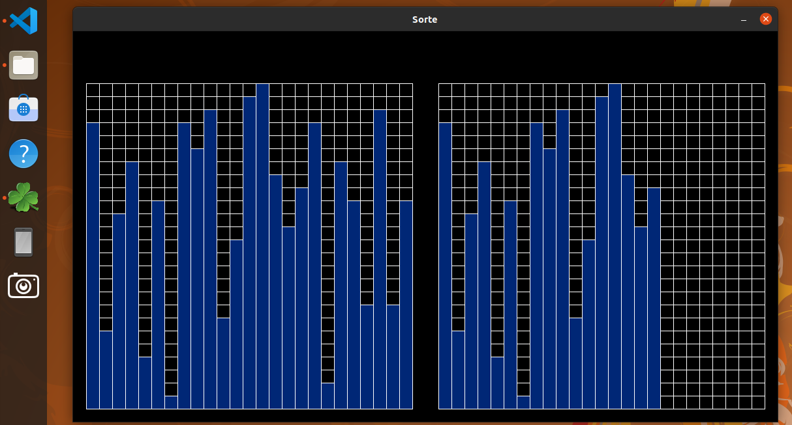
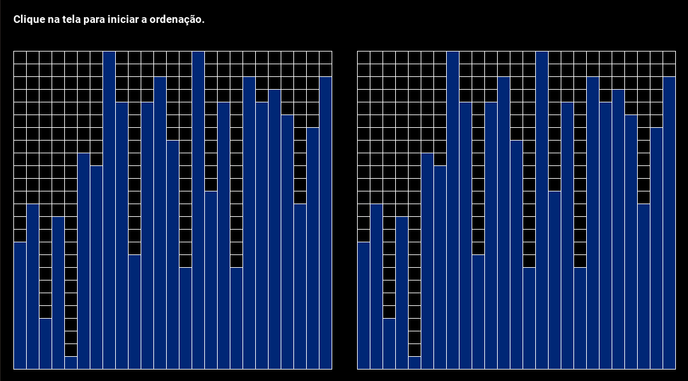
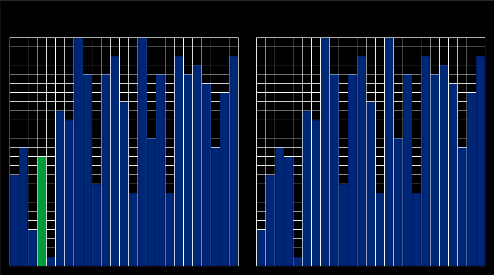
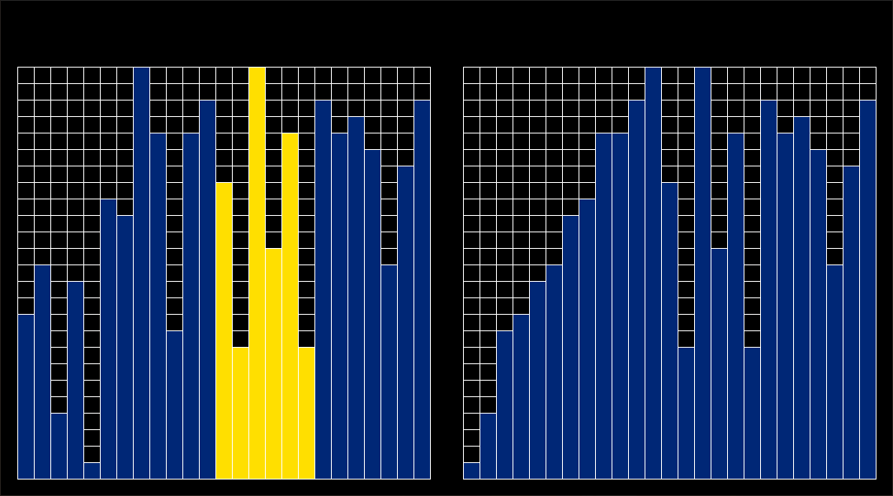
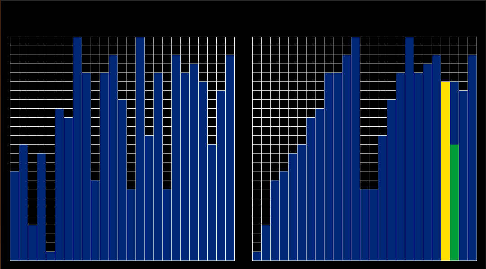
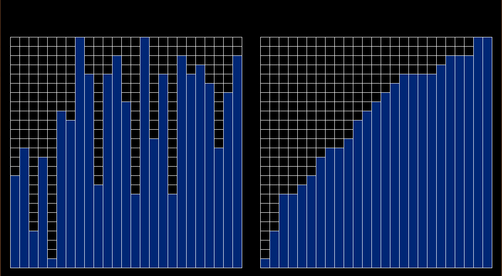

# Sorte

**Número da Lista**: 4<br>
**Conteúdo da Disciplina**: D&C<br>

## Alunos
| Matrícula | Aluno |
| -- | -- |
| 17/0013812 | [Matheus Rodrigues](https://github.com/rjoao) |

## Sobre 
O objetivo do projeto é possibilitar a visualização da aplicação do algoritmo de ***mergesort*** em uma lista com 25 números para ordená-la.

A lista é apresentada na tela como um gráfico. O eixo x representa os índices da lista e o eixo y representa os valores dos índices da lista.

São utilizados dois gráficos. No final da execução, um (da esquerda) mostrará o estado inicial da lista e o outro (da direita) mostrará a lista ordenada.

É possível separar o projeto em:
- Construção dos gráficos
    - Gerar os valores da lista aleatoriamente
    - Adicionar os valores da lista nos gráficos
- Aplicação do algoritmo na lista
    - Visualização das metades com mais de um componente
    - Visualização das metades com somente um componente
    - Visualização da união das metades
- Apresentar lista inicial e lista ordenada
    - Visualização em etapas

## Screenshots
### Construção dos Gráficos


### Tela Inicial


### Metade com 1 Componente


### Metade com +1 Componente


### Visualização de Metades


### Visualização União Metades


### Visualização Resultado


## Instalação 
**Linguagem**: Python3<br>

É necessário possuir o sistema de gerenciamento de pacotes **pip3**.

Se não possuir, no Ubuntu, rode o seguinte comando no terminal:

```
sudo apt-get install python3-pip
```

## Uso 

No terminal, primeiro instale os requisitos do projeto e depois execute o arquivo principal.

### Instalação dos requisitos

```
make install
```

### Execução do projeto

```
make run
```
